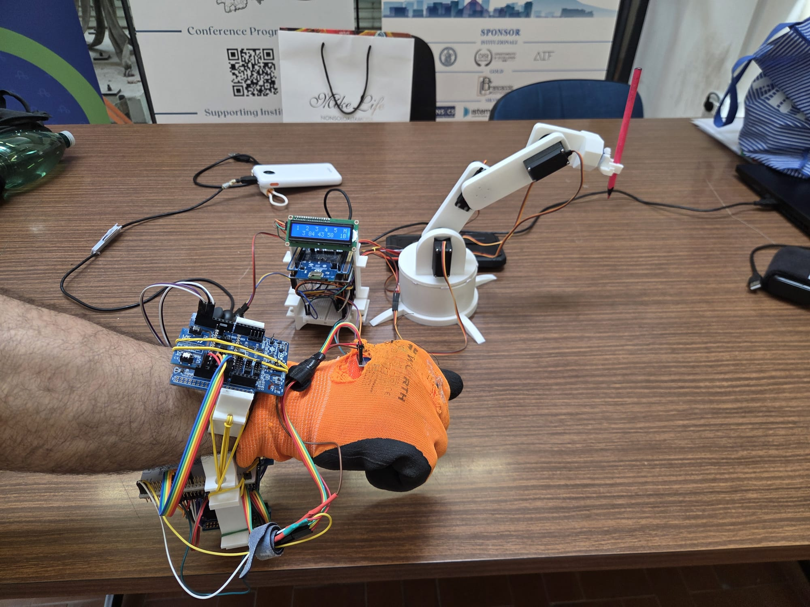

# Wearable-RoboticArmController-Stm32
Map the user's arm and hand movements, detected through inertial and flex sensors to the servomotors of a robotic arm. The system consists of two main nodes based on **STM32 Nucleo F401RE** boards that communicate wirelessly via **Bluetooth Low Energy (BLE)**.

## System Architecture
The system is divided into two main modules:

### 1. Sensor Node (Sensorized Glove)

- **Microcontroller:** STM32 Nucleo F401RE
- **Components and Sensors:**
  - **MEMS Sensors:** Accelerometer and Gyroscope (e.g., GY-521 / MPU6050 and IKS4A1 shield) connected via I2C to detect the spatial orientation of the arm (Pitch, Roll, Yaw).
  - **Flex Sensor:** Read via ADC, used to detect hand movement or finger closure (e.g., to control the robot's gripper).
- **Communication:** Bluetooth expansion module (set as **BLE Peripheral**). Continuously sends telemetry data.
- **Tools:** Includes a Python script `plot_mems.py` that allows real-time visualization of sensor data coming from the serial port on a graph.

### 2. Controller Node (Robotic Arm)

- **Microcontroller:** STM32 Nucleo F401RE
- **Components and Actuators:**
  - **Robotic Arm:** Driven by various servomotors controlled by PWM signals (generated by hardware timers TIM1, TIM2, TIM3).
  - **LCD Display:** Connected via I2C, provides a visual interface for connection status and current parameters.
  - **Joystick:** Read via ADC (channels 1-4) for manual control options or calibration.
- **Communication:** Bluetooth expansion module (set as **BLE Central**). Scans the network, automatically connects to the Sensor Node, and translates the received data into movements for the servomotors.

## Project Images

### Real Setup
Below is the complete system in operation, with the wearable controller worn and the robotic arm waiting for commands:

### System Diagram
A logical schematic of the hardware connections and data flow between the two microcontrollers:

